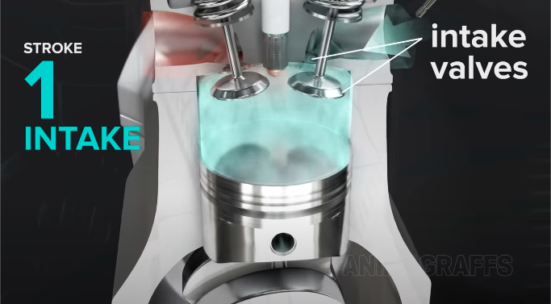
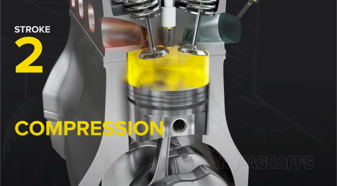
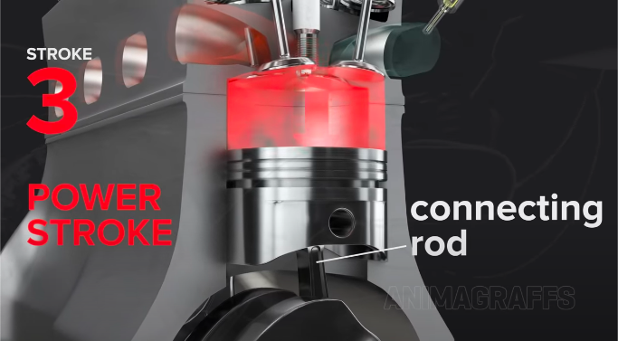
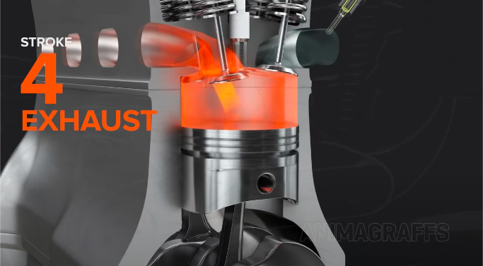

# Internal combustion cycle

- Converts gas into force.
  - To turn wheels on road.
- High-energy fuel (like gasoline) in a small enclosed space.
  - Igniting it released a lot of energy.
    - In the form of an expanding gas.
- Every car with a gasoline engine uses a **four-stroke combustion cycle**.

  - To convert gasoline into motion.
  - Called the **Otto cycle**.
    - Invented in 1867 by Nikolaus Otto.
  - Four strokes are:
    - **Intake** stroke (suck)
    - **Compression** stroke (squeeze)
    - **Power** stroke (bang)
    - **Exhaust** strike (blow)

- **Piston** is connected to the **crankshaft** by a **connecting rod**.
  - As the crankshaft spins, the cycle starts each time.
  - When a piston travel to the end of its range, up or down, its a stroke.
- Steps of the four stroke cycle:

- 1: The piston starts at the top.
  - Intake valve opens.
  - Piston moves down.
    - To let the engine take in a cylinder full of air and gasoline.
  - This is the **intake stroke** (suck).

- 2: Piston moves back up.
  - To compress the fuel-air mixture.
    - This is the **compression stroke** (squeeze).
    - Makes explosion more powerful.

- 3: Piston reaches the top of its stroke.
  - Spark plug emits a spark.
    - To ignite the gasoline.
  - The gasoline charge in the cyclinder explodes.
    - Drives the piston down.
  - Connecting rod transfers this force down to the crankshaft.
  - This is the **power stroke** (bang).

- 4: Piston reaches the bottom of its stroke.
  - Exhaust valve opens.
    - Exhaust leaves the cylinder through tailpipe.
  - This is the **exhaust stroke** (blow).
- Linear motion of pistons converted into rotational motion via crankshafts.
  - Rotational is helpful as it helps to turn car wheels.
- For smooth power delivery,
  - pistons take turns firing.
