# Manual transmission

## The clutch

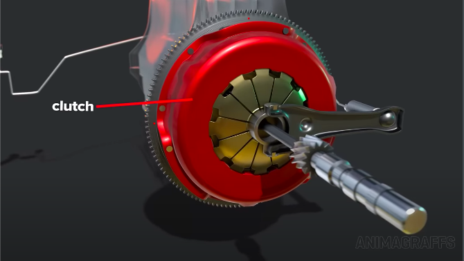

- This is the clutch wheel.

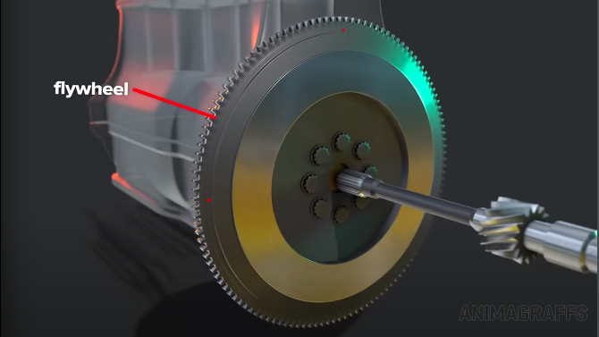

- The clutch is attached to the flywheel.
  - Which is bolted to the engine.
  - Always spinning if the car is running.

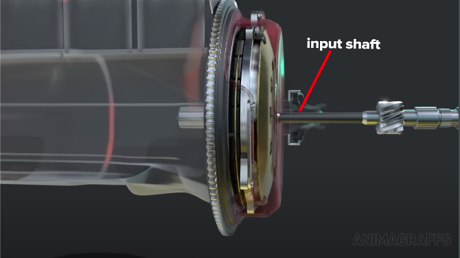

- The components inside this assembly allow power flow to be disconnected.
  - From the transmission input shaft

- The transmission input shaft does not connect to the engine crankshaft or flywheel.

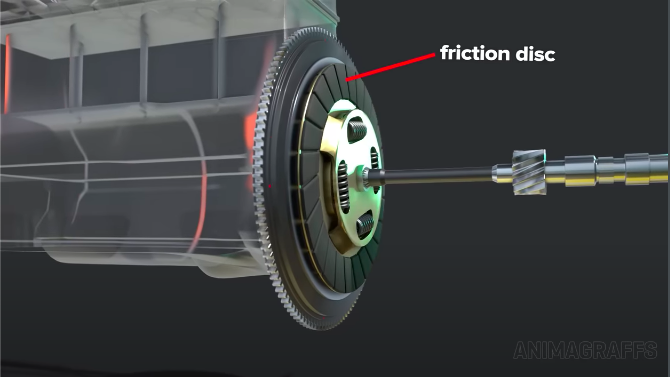

- Connection to the engine is via a sliding friction disc.
  - Also called a clutch plate.

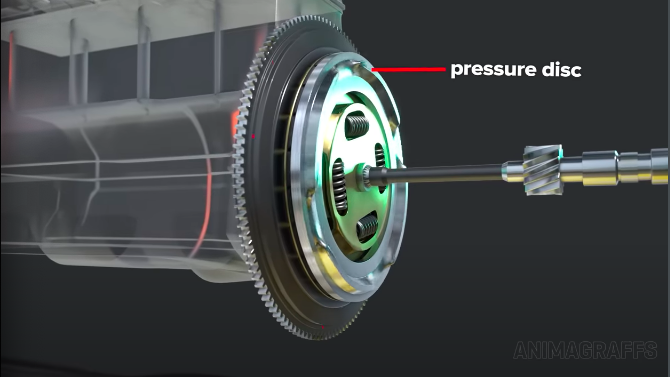

- The clutch plate (or friction disc) is between the flywheel surface and the pressure disc.

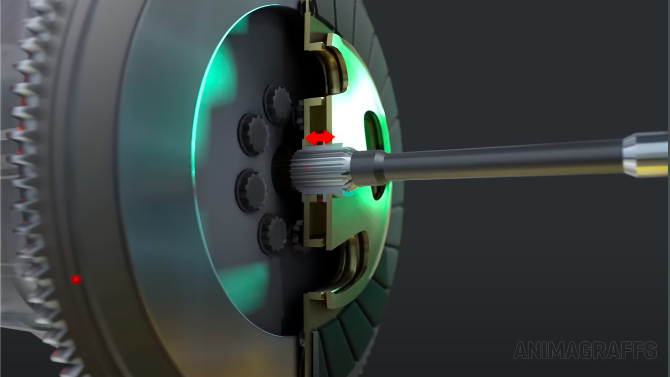

- The clutch plate assembly is attached to the transmission input shaft.
  - But has the movement mechanics to slide back and forth.

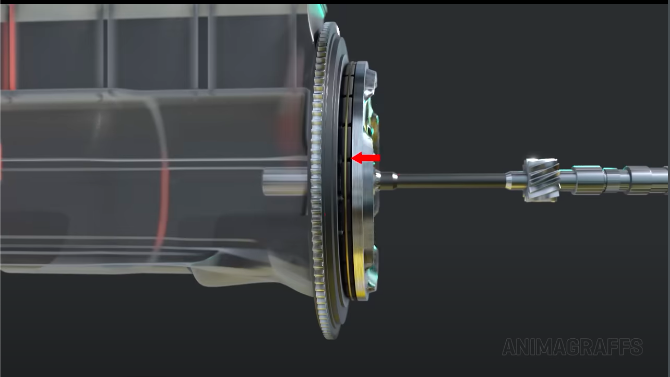

- The pressure disc can comes in contact with the engine crankshaft or flywheel.
  - Depending on the driver's pedal input.

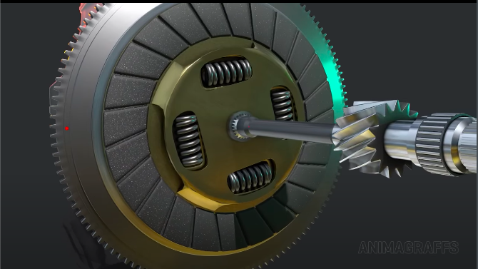

- For smooth power delivery, the clutch plate has springs.
  - Acts as a dampening system.
  - Springs continously absorb vibrations.
  - Protects against power flow anomalies.

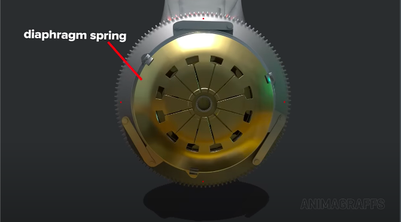

- The pressure disc is connected to the diaphragm spring.
  - This naturally presses the pressure disc to the flywheel.

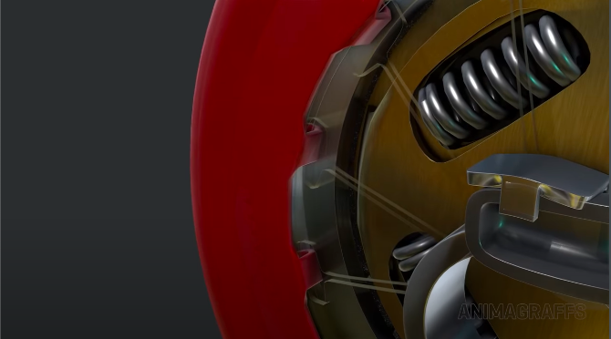

- The outer cover of the diaphragm spring has hooks.
  - To be held securely in place.
  - Also acts as a fulcrum.
    - A pivot point at which the pressure disc turns

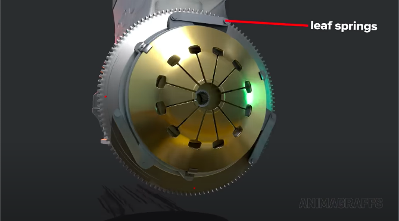

- There are additional springs, such as these leaf springs.
  - These aid the diaphragm spring's outer cover.

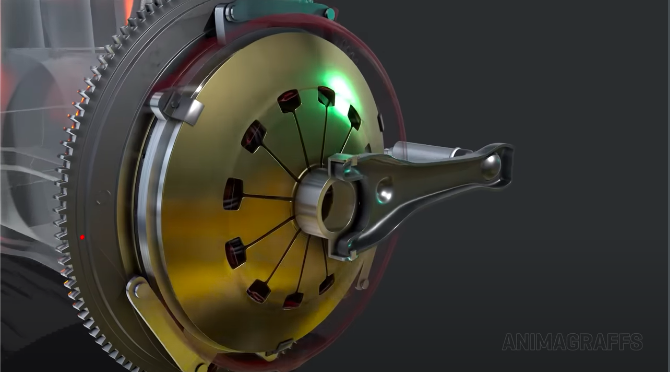

- This is the clutch fork.
  - Sits at the center of the diaphragm spring.

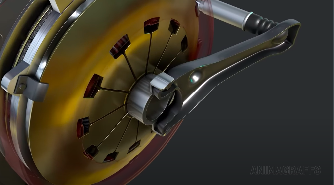

- As the clutch fork pivots, it presses in on the diaphragm spring's inner pongs.
  - Clutch fork is attached to a throwout bearing.
    - Attached to the driver's clutch pedal.
  - This lifts the outter edge and the connected pressure plate.

## Gears

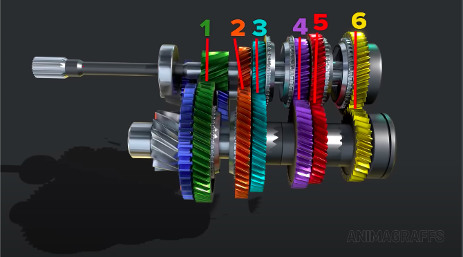

- Each speed has a gear set.
  - Input speed is different from output speed.
  - Speed gears in a constant mesh transmission are always linked.

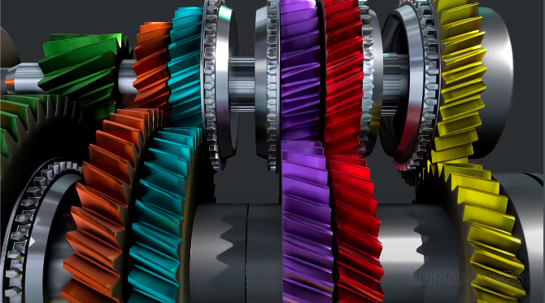

- Diagonal and helical teeth on cogs (except for reverse which has straight teeth).
  - For smooth rotations.
  - Quieter operations.

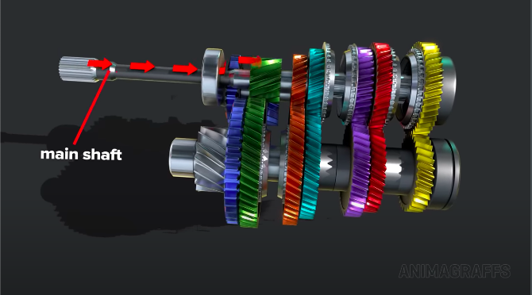

- Engine power flows through the main shaft.

- Engine power then flows to the countershaft.

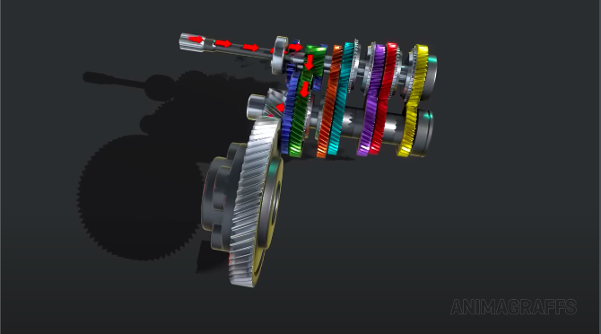

- Engine power then flows to the differential assembly.

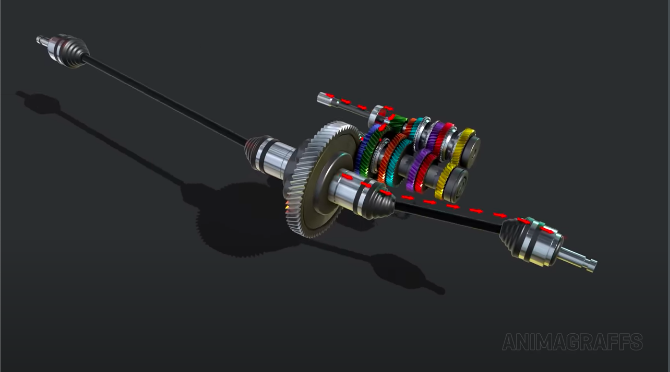

- Engine power then flows through the axles (depending on the drivetrain, i.e. AWD, RWD, or FWD).

## Synchronising gears

## Shift change assembly

## Shift lever

## Reverse gear

## Neutral gear

## Oil
