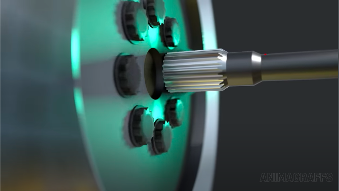
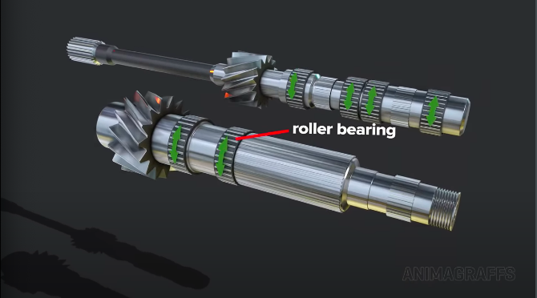
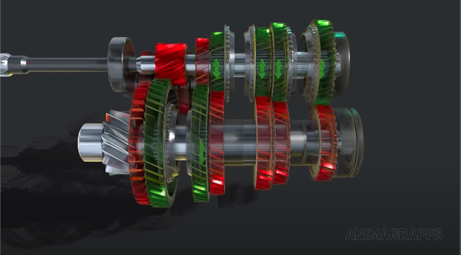
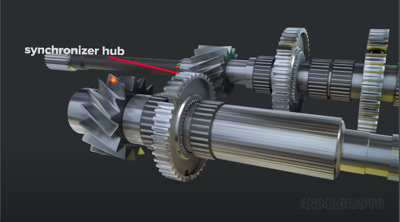
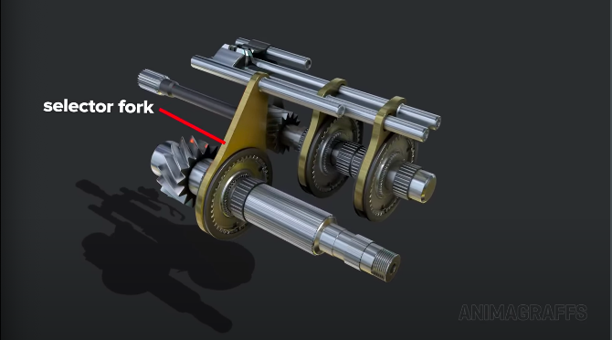
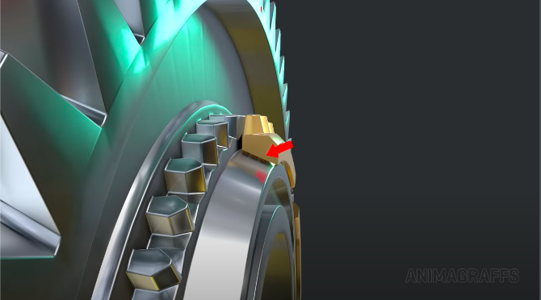
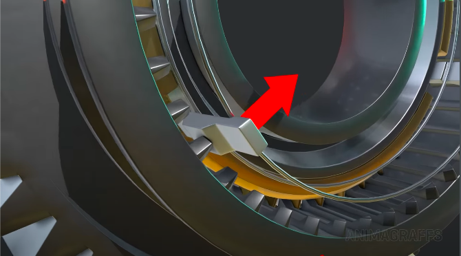

# Manual transmission

## The clutch

- This is the clutch wheel.

- The clutch is attached to the flywheel.
  - Which is bolted to the engine.
  - Always spinning if the car is running.

- The components inside this assembly allow power flow to be disconnected.
  - From the transmission input shaft

- The transmission input shaft does not connect to the engine crankshaft or flywheel.

- Connection to the engine is via a sliding friction disc.
  - Also called a clutch plate.

- The clutch plate (or friction disc) is between the flywheel surface and the pressure disc.

- The clutch plate assembly is attached to the transmission input shaft.
  - But has the movement mechanics to slide back and forth.

- The pressure disc can comes in contact with the engine crankshaft or flywheel.
  - Depending on the driver's pedal input.

- For smooth power delivery, the clutch plate has springs.
  - Acts as a dampening system.
  - Springs continously absorb vibrations.
  - Protects against power flow anomalies.

- The pressure disc is connected to the diaphragm spring.
  - This naturally presses the pressure disc to the flywheel.

- The outer cover of the diaphragm spring has hooks.
  - To be held securely in place.
  - Also acts as a fulcrum.
    - A pivot point at which the pressure disc turns

- There are additional springs, such as these leaf springs.
  - These aid the diaphragm spring's outer cover.

- This is the clutch fork.
  - Sits at the center of the diaphragm spring.

- As the clutch fork pivots, it presses in on the diaphragm spring's inner pongs.
  - Clutch fork is attached to a throwout bearing.
    - Attached to the driver's clutch pedal.
  - This lifts the outter edge and the connected pressure plate.

## Gears

- Each speed has a gear set.
  - Input speed is different from output speed.
  - Speed gears in a constant mesh transmission are always linked.

- Diagonal and helical teeth on cogs (except for reverse which has straight teeth).
  - For smooth rotations.
  - Quieter operations.

- Engine power flows through the main shaft.

- Engine power then flows to the countershaft.

- Engine power then flows to the differential assembly.

- Engine power then flows through the axles (depending on the drivetrain, i.e. AWD, RWD, or FWD).

## Synchronising gears

- To make gear shifting possible, one gear in each set float freely in its shaft.
  - Rides on a roller bearing.

- Other gears in each set is connected with splines.
  - Or directly built into the shaft itself.
- For power output, the floating gear in each set needs to be securely connected to the shaft.
  - Via the gear synchro process.

- Between each gear set is a synchroniser hub.
  - Rotates with the gear shaft.

- A sliding shift sleeve is also driven by the hub.

- The shift sleeve can be moved back and forth by a selector fork.
  - Forks are connected to sliding rods.
    - Held by the external casing.
- During gear selection, the fork moves the sleeve to the desired gear.

- A blocker ring sits between the sleeve and the gear.
  - Gets everything to spin at the same speed.
  - Lines everything up for a gear synchronisation attempt.
    - Or block further attempts if gear synchronisation isn't possible.

- The hub has three synchroniser keys that spin the blocker ring.

- Allows enough movement freedom so the blocker ring can adjust on the fly.
  - As the sleeve teeth approach.

- Internal teeth are shaped to push against the keys.
  - It then presses the blocker ring into the gear.

- The ring's inside surface is conical.
  - Has ridges to engage the cone shaped gear surface.

- The gear then begins to spin with the blocker ring.

- The gear shift keys are spring loaded.
  - Once enough pressing force builds, the keys are no longer needed.
    - They move down and out of the way.

- This allows the gear to progress into its final form.
  - The sleeve teeth are now locked in place.
  - Allows for faster gear selections with all the rotating components.
    - Whilst keeping the main gear teeth safe from the gear changing operation.
      - Locking teeth on the sleeve and gear are sometimes angled for better secure locking connections.
- Finally power flows through the:
  - Gear sychronisation hub.
  - Gear sleeve.
  - Gear set.
  - And out the gear transmission.

- To switch gears, the clutch is first pressed in.
  - Pressure is relieved.
  - Power to the engine is disconnected momentarily.
  - The sleeve can then slide in.
    - Selector fork is used to select the correct gear.

## Shift change assembly

## Shift lever

## Reverse gear

## Neutral gear

## Oil
