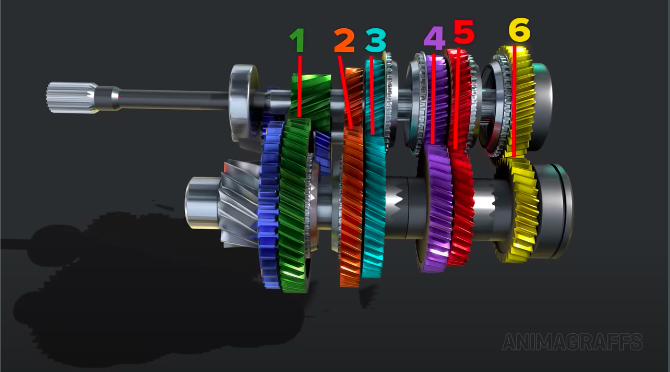
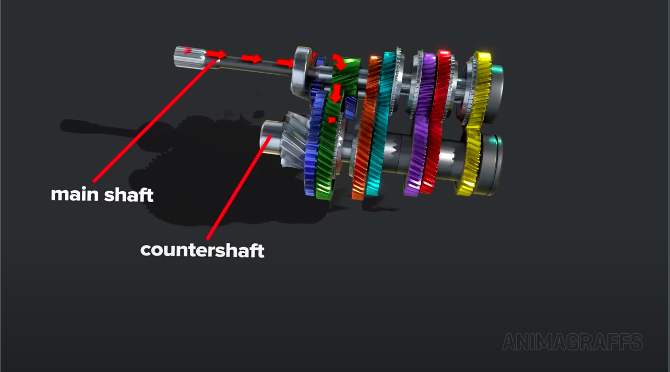

# Gears

- Each speed has a gear set.
  - Input speed is different from output speed.
  - Speed gears in a constant mesh transmission are always linked.

- Diagonal and helical teeth on cogs (except for reverse which has straight teeth).
  - For smooth rotations.
  - Quieter operations.

- Engine power flows through the main shaft.

- Engine power then flows to the countershaft.

- Engine power then flows to the differential assembly.

- Engine power then flows through the axles (depending on the drivetrain, i.e. AWD, RWD, or FWD).
