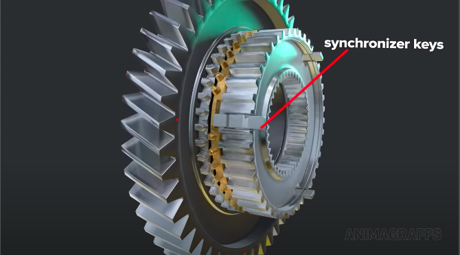

# Synchronising gears

- To make gear shifting possible, one gear in each set float freely in its shaft.
  - Rides on a roller bearing.

- Other gears in each set is connected with splines.
  - Or directly built into the shaft itself.
- For power output, the floating gear in each set needs to be securely connected to the shaft.
  - Via the gear synchro process.

- Between each gear set is a synchroniser hub.
  - Rotates with the gear shaft.

- A sliding shift sleeve is also driven by the hub.

- The shift sleeve can be moved back and forth by a selector fork.
  - Forks are connected to sliding rods.
    - Held by the external casing.
- During gear selection, the fork moves the sleeve to the desired gear.

- A blocker ring sits between the sleeve and the gear.
  - Gets everything to spin at the same speed.
  - Lines everything up for a gear synchronisation attempt.
    - Or block further attempts if gear synchronisation isn't possible.

- The hub has three synchroniser keys that spin the blocker ring.

- Allows enough movement freedom so the blocker ring can adjust on the fly.
  - As the sleeve teeth approach.

- Internal teeth are shaped to push against the keys.
  - It then presses the blocker ring into the gear.

- The ring's inside surface is conical.
  - Has ridges to engage the cone shaped gear surface.

- The gear then begins to spin with the blocker ring.

- The gear shift keys are spring loaded.
  - Once enough pressing force builds, the keys are no longer needed.
    - They move down and out of the way.

- This allows the gear to progress into its final form.
  - The sleeve teeth are now locked in place.
  - Allows for faster gear selections with all the rotating components.
    - Whilst keeping the main gear teeth safe from the gear changing operation.
      - Locking teeth on the sleeve and gear are sometimes angled for better secure locking connections.
- Finally power flows through the:
  - Gear sychronisation hub.
  - Gear sleeve.
  - Gear set.
  - And out the gear transmission.

- To switch gears, the clutch is first pressed in.
  - Pressure is relieved.
  - Power to the engine is disconnected momentarily.
  - The sleeve can then slide in.
    - Selector fork is used to select the correct gear.
